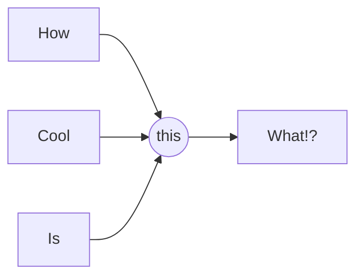

### Steps to creating a cpp file to interact with ros:

#### Clone repository to catkin workspace:
```ruby
~/catkin_ws/src
git clone git@github.com:lukuky64/robotics_studio_2023.git

```


#### Compile using Cmake
##### From VSCode:
```ruby
cd build
cmake .
make
```

##### From ubuntu terminal:
```ruby
~/catkin_ws
catkin_make
source devel/setup.bash
source /opt/ros/noetic/setup.bash

```

### Run from ubuntu terminal:
```ruby
roscore
~/catkin_ws/src/CPP_with_ROS/build/devel/lib/ros_interact/ros_interact_node
```


# Something cool:



# something else:

> __this is also kind of cool__  
> _im just going to keep writing_  
> here so you can see it fully  
> you have to do double space at the end to create a new line  


# something else:
| Left Column | Right Column |
| :---------: | :---------=: |
| 2 | 5 |
| 4 | 10 |
| 6 | 15 |
| 2 | 5 |
| 4 | 10 |
| 6 | 15 |


